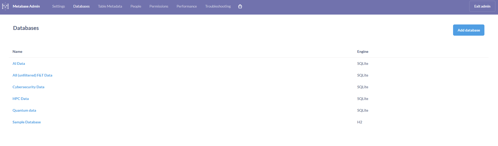
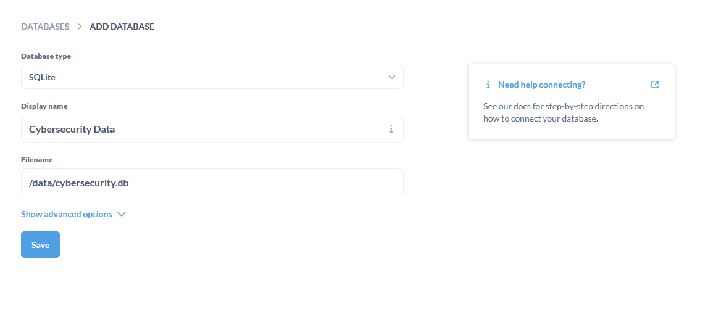
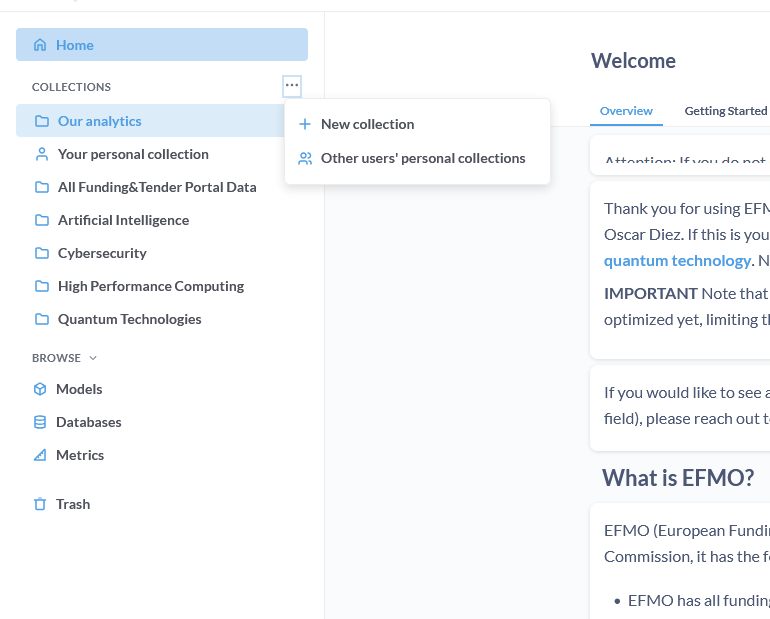

# Creating a new monitoring workflow for a new topic

## Preparations

#### Checks
- Is the topic already covered by a different workflow? Check [this table](http://quantum-monitor.cnect-srv4dev.s4dad.aws.cloud.tech.ec.europa.eu:3000/dashboard/38?tab=44-onboarding-status) for a current list of topics and units. 
- Is the topic sufficiently concrete? Good Examples: "Quantum technologies", "Semiconductor Chips", etc. Bad examples: "Science", "Industry",...

#### Obtaining keywords

The keywords are needed for a basic keyword filter (see [data processing](data_processing.md) for more details on how exactly they are used). They should be chosen, such that projects which are obviously not part of the topic are sorted out before the LLM categorization is applied in the next step. 

As an example, for quantum technologies the keywords read:

```
keyword_list = ["quantum", "quantum mechanic", " qt ", "quantum flagship", "qt flagship", "qubit", "trapped ion", "quantum cryptography", "quantum communic", "quantum dyn", "quantum comput",
            "quantum simula", "quantum dot", "supercoducting qubit", "neutral atoms", "quantum physic", "quantum optic", "quantum circuit", "quantum superposit", "quantum metrology", "quantum sens",
            "quantum gas", "quantum inform", "quantum scatt","ultracold atom", "ultracold molecul", "quantum noise", "quantum projec", "quantum grav", "quantum phase", "quantum correlati", "quantum entangle",
                "atom interferom", "quantum transport", "quantum imagi", "feshbach resonan", "ultracold gas", "optical clock", "optical lattice clock", "quantum critic", "quantum magnet", "quantum techno", "quantum engineer", "quantum optimi", "quantum financ", "quantum interfer", "quantum gas microsc",
            "quantum key distrib", "quantum encryp", "quantum internet", "quantum photon", "variational quantum", "quantum correl", "quantum syste", "quantum effect", 
                "quantum thermodynamics", "quantum emitter", "quantum fluid", "quantum material", "qkd network", "euroqci", "psot-quantum", "wave function", "quantum diagnostics",
            "non-classical st", "entangled state", "multi-mode enta"]
```

Note that
- most keywords only contain the root of the word, such that it is less dependent on grammatical details. For example, "quantum comput" covers both "quantum computing" and "quantum computation"
- all keywords have acertain minimum length in order to minimize the changes, that the same combination of latters occurs in unrelated projects. For example, "ai" (for artificial intelligence) is a bad keyword, as "ai" occurs in many unrelated words such as "vain" or "again". However, " ai " works better as it demands that "ai" appears as a standalone word. As another example, "qkd" (Quantum Key distribution) would be fine as a keyword (even without the spaces) since this acronym is a combination of letters that does not appear in other words.
- all keywords have a clear relation to the target topic "quantum". For instance, "Internet" alone would wrongly flag many non-quantum projects as relevant, while "quantum internet" is much more targeted and sopecific. 

It is probably best to let the contact person in the unit draft a list of keywords and then manually adapt the list, such that the recommendations above are respected. 


#### Obtaining categories


Next, the contact person should be asked to provide a categorization scheme for the topic of his choice.

For quantum, the final (optimized) categorization looks like this:


- *"quantum computing": A quantum computer is a computer that exploits quantum mechanical phenomena (also quantum simulators), by manipulating quantum bits (qubits) and quantum gates, including firmware, error-correction,readout, diagnostics and characterisation systems, and also software and algorithms. Quantum simulators are devices that actively use quantum effects to answer questions about realizable model systems and, through them, to get results about systems of practical interest (such as superconductors, simulated using arrays of cold atoms). Quantum software refers to software designed to run on quantum computers,  including SDKs and frameworks, programming languages, development tools, orchestration, UI, QaaS, end-user software, cloud, AI and machine learning. This category should also include technologies enabling quantum computing and quantum simulators and building blocks of quantum computers and quantum simulators, if they can be considered a part of the second quantum revolution, e.g. qubits, control electronics, twpa amplifiers.*
- *"quantum sensing": The application of quantum systems to constructing more sensitive or more compact sensors of physical properties or fields, such as temperature, distance/displacements, electric or magnetic fields, and also accelerations, rotations, pressure and gravity. Quantum sensing applications also include quantum imaging and lidar. This category should also include technologies enabling quantum sensing and metrology, if they can be considered a part of the second quantum revolution.*
- *"quantum communication": communication that uses quantum physics to transmit and protect data, and potentially to enable connections between quantum computers. This category also includes quantum safe protocols and quantum cryptography (quantum key distribution, post quantum cryptography, applications of quantum cryptography), and quantum networking (qubit transfer, modems, transducers, repeaters and memory). This category should also include technologies enabling quantum communication and quantum networks, if they can be considered a part of the second quantum revolution.*      
- *"basic science": Basic or fundamental research in quantum science which at some point may be relevant to quantum computing, quantum sensing or quantum communication, and which is part of the second quantum revolution. *
- *"not second quantum revolution": This category is for projects which are not related to quantum science or quantum technologies, or which cannot be considered part of the second quantum revolution. It is for all projects which do not fit into the other categories.*
        

Note that there are two types of categories:
- categories for classfiying relevant projects, like "quantum computing", "quantum sensing" etc. 
- categories for capturing irrelevant projects that are not part of the topic: "not second quantum revolution"

The latter can be later removed from the data. Thus, the LLM categorization cannot only be used for categorizing but also for filtering. 


We may also want to apply multiple categorizations at the same time. In the case of quantum technologies, we may ask also ask what platform is used by the project: *"superconducting", "trapped ion", "neutral atoms", "silicon", "diamond", "photonic", "other"*


Other examples for categorizations could be:
- What is the TRL?
- How could we categorize possible applications?

One should discuss these options with the contact person and establish three questions to the LLM.


## Implementation


#### Creating a new workflow settings class

The first step is to create a new workflow settings class in the ```workflow_settings.py``` file. You can do this by creating a copy of the, e.g., quantum workflow settings class

```python
class quantum_settings:
    topic = "quantum"
    (...)
```

and giving it a new name. Let us assume we want to create a new topic "cybersecurity", thus we could call the class:

```python
class cybersecurity_settings:
    topic = "cybersecurity"
    (...)
```

Next, we need to go through the class and adapt all the settings to the new topic. In the following we will address different parts of the settings class, see also [the workflow documentation](elmo_workflow.md) for more details about all variables in the settings file. 

##### Filenames

```python
    if not os.path.exists(f"data/{topic}"):
        os.makedirs(f"data/{topic}")
    if not os.path.exists(f"deliverables/{topic}"):
        os.makedirs(f"deliverables/{topic}")
    data_source = "f&t"
    filtered_projects_filename= f'data/{topic}/filtered_projects.csv'
    filtered_organizations_filename = f'data/{topic}/filtered_organizations.csv'
    filtered_prev_projects_filename = f'data/{topic}/filtered_projects_prev.csv'
    processed_diff_projects_filename = f'data/{topic}/processed_projects_diff.csv'
    manual_project_data_filename = f'data/{topic}/input_manual_projects.csv'
    manual_orga_data_filename = f'data/{topic}/input_manual_orgas.csv'
    matchscore_histogram_filename = f'data/{topic}/matchscore_histogram.png'
    db_filename = f'deliverables/{topic}/{topic}.db'
    
```

There is no need to touch this part since all filenames are derived from the ```topic``` name. 


##### LLM Source

```python
llm_location = "remote"
```
Check out the documentation on [data processing](data_processing.md) for more info. It make sense to leave this set to "remote" for now. However, in the future the LLM may be hosted locally or a different API may be used. 

##### Workflow control variables


```python

    suppress_llm_categorization = False
    import_manual_data = False #changed
    send_deliverable = False
    send_newsletter = False
```

These variables control whether certain parts of the workflow are executed. We can keep them set as shown above for now but may need to change them when debugging the new workflow. 


##### Match Score threshold

```python
match_score_threshold = 0.0001 #changed
```

We can set this variable to a very small non-zero value for now. 

##### Keywords

```python
keyword_list = [
    "cybersecurit",
    "network securit",
    "information securit",
    "cyber threat",
    "malware",
    "phishing",
    "encryption",
    "firewall",
    "data protect",
    "incident response",
    "penetration test",
    "vulnerability assessment",
    "identity and access management",
    "cloud security",
    "endpoint security",
    "intrusion detection",
    "cyber risk management",
    "security operations center",
    "threat intelligence",
    "zero trust security",
    "ransomware",
    "social engineering",
    "multi-factor authenticat",
    "cyber forensics",
    "siem",
    "compliance and regulation",
    "iot security",
    "artificial intelligence in cybersecurity",
    "blockchain security",
    "quantum cryptography",
    "biometric authentication",
    "ddos protection",
    "data loss prevention",
    "security awareness training",
    "cyber insurance",
    "ethical hacking",
    "devsecops",
    "mobile security",
    "supply chain security",
    "privacy by design"
]

```


We replace the keywords with those obtained (and optimized) for cybersecurity. 

##### LLM Prompt

Based on the categorization input received from the contact person we need to compose a well-working prompt for the LLM. 


For the quantum technology workflow, the final prompt is:


```python

prompt_instruction="""The following description belongs to an EU-funded project. Is the project part of the second quantum revolution? If yes, classify the project by assigning it to one of the following categories: 
        - "quantum computing": A quantum computer is a computer that exploits quantum mechanical phenomena (also quantum simulators), by manipulating quantum bits (qubits) and quantum gates, including firmware, error-correction,readout, diagnostics and characterisation systems, and also software and algorithms. Quantum simulators are devices that actively use quantum effects to answer questions about realizable model systems and, through them, to get results about systems of practical interest (such as superconductors, simulated using arrays of cold atoms). Quantum software refers to software designed to run on quantum computers,  including SDKs and frameworks, programming languages, development tools, orchestration, UI, QaaS, end-user software, cloud, AI and machine learning. This category should also include technologies enabling quantum computing and quantum simulators and building blocks of quantum computers and quantum simulators, if they can be considered a part of the second quantum revolution, e.g. qubits, control electronics, twpa amplifiers.
        - "quantum sensing": The application of quantum systems to constructing more sensitive or more compact sensors of physical properties or fields, such as temperature, distance/displacements, electric or magnetic fields, and also accelerations, rotations, pressure and gravity. Quantum sensing applications also include quantum imaging and lidar. This category should also include technologies enabling quantum sensing and metrology, if they can be considered a part of the second quantum revolution.
        - "quantum communication": communication that uses quantum physics to transmit and protect data, and potentially to enable connections between quantum computers. This category also includes quantum safe protocols and quantum cryptography (quantum key distribution, post quantum cryptography, applications of quantum cryptography), and quantum networking (qubit transfer, modems, transducers, repeaters and memory). This category should also include technologies enabling quantum communication and quantum networks, if they can be considered a part of the second quantum revolution.        
        - "basic science": Basic or fundamental research in quantum science which at some point may be relevant to quantum computing, quantum sensing or quantum communication, and which is part of the second quantum revolution. 

        If the project is not part of the second quantum revolution or if its does not fit into the categories above, classify it as:
        - "not second quantum revolution": This category is for projects which are not related to quantum science or quantum technologies, or which cannot be considered part of the second quantum revolution. It is for all projects which do not fit into the other categories.

        The Second Quantum Revolution refers to the current era of quantum technology advancements, characterized by our ability to manipulate and control individual quantum systems with unprecedented precision. This revolution is defined by the development of technologies that harness quantum phenomena such as superposition and entanglement to create novel applications. Unlike the First Quantum Revolution, which led to (e.g. semicondictor-based) inventions like transistors, lasers based on collective quantum effects, the Second Quantum Revolution focuses on exploiting individual quantum particles and their unique properties.

        Select exactly one category. Only respond with the category name without quotation marks, nothing else!
        
        Please append to the response (after a comma) one of the following keywords describing the platform on which the quantum computer is based: "superconducting", "trapped ion", "neutral atoms", "silicon", "diamond", "photonic", "other". If the platform is not known, please respond with "unknown".

        Please also append to the response (after another comma) a TRL level from 1 to 9.
        
        ""@

```

Let us break it down:

We start with brief introduction mentioning the core of the topic we are interested in: 

>*The following description belongs to an EU-funded project. Is the project part of the second quantum revolution? If yes, classify the project by assigning it to one of the following categories:*

Next, we list the categories considered as relevant as provided by the contact person, together with their definition:


>- "quantum computing": A quantum computer is a computer that exploits quantum mechanical phenomena (also quantum simulators), by manipulating quantum bits (qubits) and quantum gates, including firmware, error-correction,readout, diagnostics and characterisation systems, and also software and algorithms. Quantum simulators are devices that actively use quantum effects to answer questions about realizable model systems and, through them, to get results about systems of practical interest (such as superconductors, simulated using arrays of cold atoms). Quantum software refers to software designed to run on quantum computers,  including SDKs and frameworks, programming languages, development tools, orchestration, UI, QaaS, end-user software, cloud, AI and machine learning. This category should also include technologies enabling quantum computing and quantum simulators and building blocks of quantum computers and quantum simulators, if they can be considered a part of the second quantum revolution, e.g. qubits, control electronics, twpa amplifiers.
>- "quantum sensing": The application of quantum systems to constructing more sensitive or more compact sensors of physical properties or fields, such as temperature, distance/displacements, electric or magnetic fields, and also accelerations, rotations, pressure and gravity. Quantum sensing applications also include quantum imaging and lidar. This category should also include technologies enabling quantum sensing and metrology, if they can be considered a part of the second quantum revolution.
>- "quantum communication": communication that uses quantum physics to transmit and protect data, and potentially to enable connections between quantum computers. This category also includes quantum safe protocols and quantum cryptography (quantum key distribution, post quantum cryptography, applications of quantum cryptography), and quantum networking (qubit transfer, modems, transducers, repeaters and memory). This category should also include technologies enabling quantum communication and quantum networks, if they can be considered a part of the second quantum revolution.        
>- "basic science": Basic or fundamental research in quantum science which at some point may be relevant to quantum computing, quantum sensing or quantum communication, and which is part of the second quantum revolution. *

Next, we introduce the categoryu considered as irrelevant:
>If the project is not part of the second quantum revolution or if its does not fit into the categories above, classify it as:
>- "not second quantum revolution": This category is for projects which are not related to quantum science or quantum technologies, or which cannot be considered part of the second quantum revolution. It is for all projects which do not fit into the other categories.


With that we have finished introducing the first categrozation for assigning each project to a *pillar* of quantum technology. Since the relevant and the irrelevant categories are seperated by the very specific notion of "second quantum revolution", we additionally provide the LLM with a definition of what that is:

> The Second Quantum Revolution refers to the current era of quantum technology advancements, characterized by our ability to manipulate and control individual quantum systems with unprecedented precision. This revolution is defined by the development of technologies that harness quantum phenomena such as superposition and entanglement to create novel applications. Unlike the First Quantum Revolution, which led to (e.g. semicondictor-based) inventions like transistors, lasers based on collective quantum effects, the Second Quantum Revolution focuses on exploiting individual quantum particles and their unique properties.


Next, we remind the LLM to choose only one category and reply with the category name without any additional text:

>Select exactly one category. Only respond with the category name without quotation marks, nothing else!

We then introduce the second categorization, to be appended to the first one, separated by a comma:

>Please append to the response (after a comma) one of the following keywords describing the platform on which the quantum computer is based: "superconducting", "trapped ion", "neutral atoms", "silicon", "diamond", "photonic", "other". If the platform is not known, please respond with "unknown".

And the third categorization (TRL level):

> Please also append to the response (after another comma) a TRL level from 1 to 9.


The prompt is then automatically extended by the description of the project in quotation marks. 


For each project, the LLM is then expected to output a response like this:

```
{pillar}, {platform}, {TRL}
```

So, for example:

```
quantum computing, neutral atoms, 4
```


##### Mapping Dictionaries


The mapping dictionaries are used for two purposes:
- removing irrelevant categories from the data
- cleaning up catergorization mistakes by the LLM

For each LLM question we need a mapping dictionary. In case of the quantum workflow, the mapping dictionaries for pillar, platform and TRL are:

```python

    mapping_dict = {  #Pillar
        "quantum comp": "quantum computing",
        "quantum communication": "quantum communication",
        "quantum sensing": "quantum sensing",
        "basic": "basic science"
    }


    sub_mapping_dict = { #Platform
        "superconduct": "superconducting",
        "trapped ion": "trapped ions",
        "neutral atoms": "neutral atoms",
        "silicon": "diamond",
        "photonic": "photonic",
        "other": "other"
    }


    trl_mapping_dict = { #TRL
        "9": 9,
        "8": 8,
        "7": 7,
        "6": 6,
        "5": 5,
        "4": 4,
        "3": 3,
        "2": 2,
        "1": 1,
    }

```

The output of the LLM is split by comma and each part of the response is cleaned according to the respective mappings above. Cleaning means that if the response is contained in one of the keys of the dictionary, it will be replaced with the value of the corresponding key. For example, the dictionaries above would change responses as follows:

- ```quantum computing, neutral atoms, 3``` becomes ```quantum computing, neutral atoms, 3```
- ```quantum computation, neutral atoms, 3``` becomes ```quantum computing, neutral atoms, 3```
- ```basic quantum science, neutral atoms, 3```becomes ```basic science, neutral atoms, 3```
- ```quantum computing, neutral atoms, '3'```becomes ```quantum computing, neutral atoms, 3```
- ```quantum computing, neutral atoms, 11```becomes ```quantum computing, neutral atoms, nan```
- ```quantum computing, unknown, 11```becomes ```quantum computing, nan, nan```

This allows to correct small mistakes in the LLM's output such as slightly altered category names or additional symbols (e.g. quotation marks). If the response is not part of any keys of the mapping dictionary, it will be changed to "nan". By default, *projects that are assigned to "nan" in the first category are removed from the data*. In case of the quantum workflow, these projects correspond to the ones classified as "not second quantum revolution" by the LLM, so the removal makes sense. When adapting this scheme to a different topic, care must be taken that all non-relevant topics (by assignment in the **first** categorization) are assigned to nan. Here, this is achieved by not mentioning the category "not second quantum revolution" in the mapping dictionary fo the first categorization ```mapping_dict```.


##### Evaluations 

By default, all evaluations currently defined in the ```evaluations.py``` file (see [this section](data_evaluation.md)) are turned on and will produce special figures in the deliverables folder. 


```python
    evaluations = {
        "TotalFundingByFPOverTime": TotalFundingByFPOverTime,
        "TotalFundingByLLMCategoryOverTime": TotalFundingByLLMCategoryOverTime,
        "OrganizationsByCountryGroupOverTime": OrganizationsByCountryGroupOverTime,
        "OrganizationTypeByCountryGroupOverTime": OrganizationTypeByCountryGroupOverTime,
        "TotalFundingbyFP": TotalFundingbyFP
    }
```


##### Delivery settings

The delivery settings are only relevant in case a delivery of plots or a listof new projects by email is desired. Not so important for now. 

```python

    deliverable_email_settings = {
        "sender": "CNECT.C2 EFMO", 
        "recipients": ["no-reply@ec.europa.eu"], #add emails here
        "subject": "C2 EFMO Cybersecurity Deliverables", 
        "message": "Please find the Cybersecurity deliverables attached."
    }

    newsletter_email_settings = {
        "sender": "CNECT.C2 EFMO", 
        "recipients": ["no-reply@ec.europa.eu"], #add emails here
        "subject": "Cybersecurity Monitor Newsletter", 
    }

```


#### Defining the workflow

With a new settings class in place, wen can now create a workflow which uses these settings. 
We will use the same monitoring workflow as for the other topics (see [EFMO workflow](efmo_flow.md)). Thus, all we need to do is open the ```scheduler.py``` file add add the line:

```python
hpc_workflow = MonitorWorkflow("cybersecurity", cybersecurity_settings)
```
below the existing workflow definitions. 

Also make sure that the new ```cybersecurity_settings``` are imported in ```scheduler.py```

```python
from workflow_settings import quantum_settings, hpc_settings, sourcing_settings, ai_settings, cybersecurity_settings
```


## Debugging and testing

For testing the workflow, we temporarily add the following line underneath the workflow definitions in ```scheduler.py```:

```python
cybersecurity_workflow.run()
```

such that when running ```scheduler.py```, the workflow is started directly. 

Make sure that the workflow settings are:

```python
    suppress_llm_categorization = False
    import_manual_data = False
    send_deliverable = False
    send_newsletter = False
```

Next, wen run ```scheduler.py``` by typing 

```
pipenv run python scheduler.py
```

in the terminal (assuming we are in the folder of the repo).


The workflow will start by performing the keyword matching algorithm, followed by the LLM categorization. For now we are only interested in the keyword matching so we can kill the program ince the keyword matching is complete. The output should look like this:


and will tell you how many of the projects have survived the keyword filtering, based on the provided keywords. Please make sure that the number of projects after this step does not exceed ca. 3000, as the maximum rate of LLM-based project processing is currently 300/hour (see [data processing](data_processing.md)). 


Next, after ensuring that the number of projects after the keyword filter is not too large, restart the scheduler and let the entire workflow run. 


If the workflows completes, you should see this message in schedule: 
.
Additional, there should be a new database file in ```deliverables/{name of the topic}```. 
If you do not see these signs, the workflow porbably has failed and needs to be debugged. Use the error message in your terminal as a starting point. Consider running the scheduler in a temux environment so that the process is not killed when you log out of the ssh session. You may also temporarily change ```suppress_llm_categorization``` to True if needed but do not forget to change it back. 


If the workflow has been successful, please DO NOT FORGET to remove the ```cybersecurity_workflow.run()``` command from ```scheduler.py```. Instead add a scheduling command, such as ```schedule.every().tuesday.at("06:35").do(lambda: cybersecurity_workflow.run())```, similar to the existing workflows. Now the workflow will run regularly as specified. 


## Final steps


In order for making the database accessible to the frontend Metabase dashboard you have two options:
- Wait till the next morning when the crontab job will copy all database files from the ````deliverables``` folder to the Metabase folder
- Do it manually now, by running ```sudo find "/home/ubuntu/connect-monitor/deliverables" -type f -name "*.db" -exec cp {} "/var/lib/docker/volumes/cnect-monitor-data/_data/" \;``` in the terminal.


Once the database is in the Metabase folder, it needs to be added to the dashboard by the Metabase admin account (see [here](metabase.md) for credentials). Go to the [database section](http://quantum-monitor.cnect-srv4dev.s4dad.aws.cloud.tech.ec.europa.eu:3000/admin/databases) in the admin panel and add the new database as follows:





After adding the database, all dashboard users can play with the data. In alignment with the existing topics you should create a collection for the new topic and a simple dashboard inside this collection:




Finally, please [update the onboarding status](http://quantum-monitor.cnect-srv4dev.s4dad.aws.cloud.tech.ec.europa.eu:3000/dashboard/38?tab=44-onboarding-status) on the welcome dashboard.


## Further iterations

Once, the the onboarding is complete, you should provide the dashboard to the unit you were in contact with. It may be their job to review the filtered data, paying attention to the categorizations performed by the LLM. They may want to check what projects ended up in which category. Based on that they should make changes to the categorization an possibly also the keywords. Once an updated set of keywords and a new categorization taxonomy has been received the workflow settings should be updated accordingly and a new run scheduled ASAP. There may be multiple iterations of this kind until everyone is happy with the categorization. Remember to not accept blame on the LLM. If the LLM makes unsatisfying decisions, it is almost certainly due to an suboptimal or incomplete categorization scheme. And that may be caused by the unit's poor understanding of the field. 


You may at some point activate the newsletter function which sends out emails with a list of newly added projects about the topic. For that, please change ```send_newslette``` to True and add the reciepients to the newsletter settings in the workflow settings file. 


